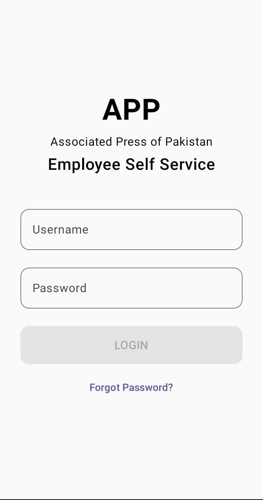
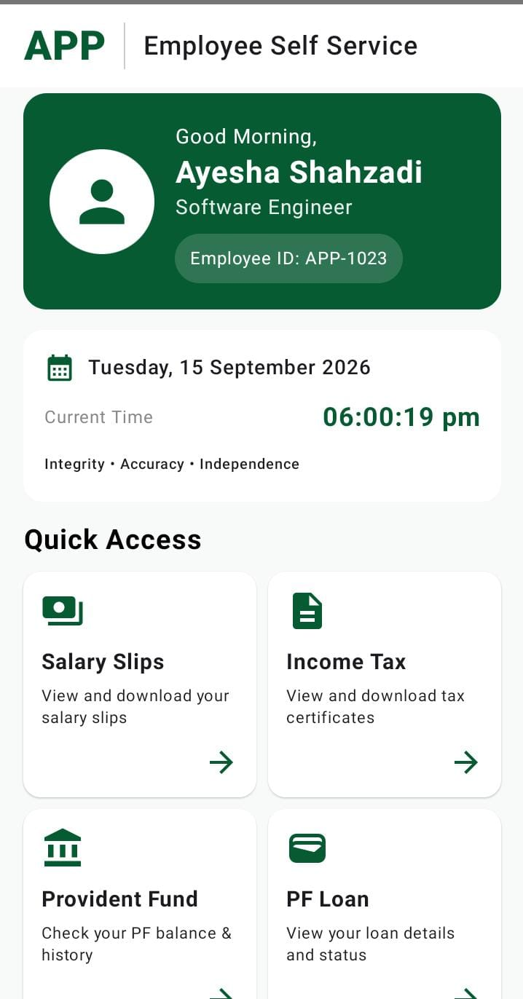
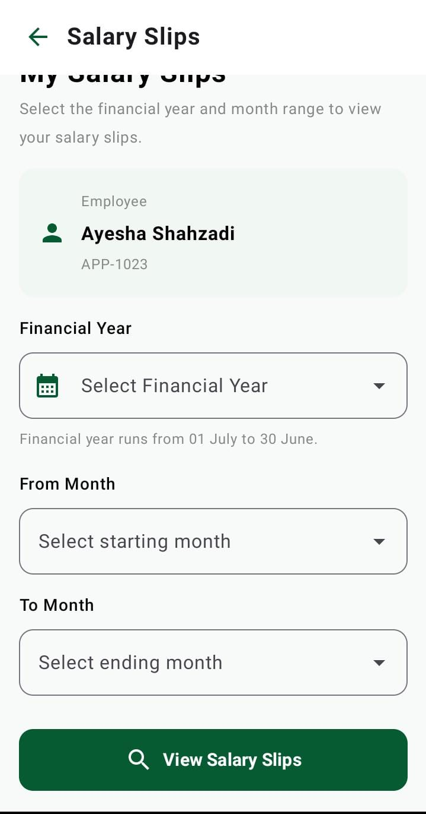
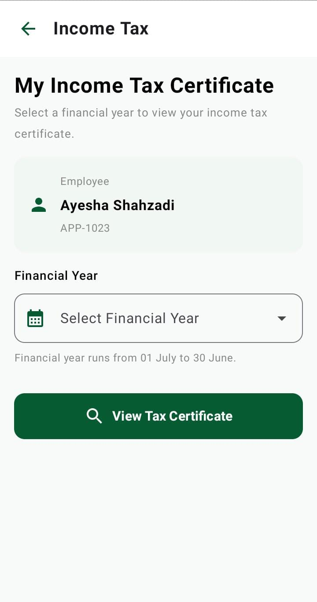
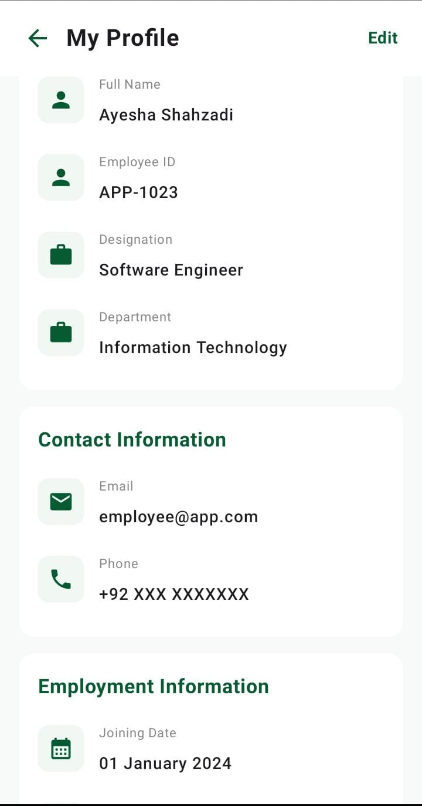

# Employee Self-Service Mobile Application

## 📱 Project Overview
A mobile Employee Self-Service application designed to provide employees
with secure and convenient access to their employment-related information.

## ✨ Features
- Employee Profile
- Salary Information
- Income Tax
- Provident Fund
- PF Loan
- Leave History
- Employee Documents
- REST API Integration
- Secure employee-specific data access

## 🛠️ Technologies
- Kotlin
- Android
- Jetpack Compose
- Android Studio
- REST APIs
- JSON

## 📂 Project Modules
...

## 🔌 API Integration
...

## 📸 Screenshots

### Login

### Dashboard

### Salary

### Income Tax

### Profile

### splash

## 📸 App Screenshots

  
  
  
  
  
   

## 🚀 Installation
...

## 👩‍💻 Developer
Ayesha Shahzadi
BS Computer Science

## 📄 License
No License
